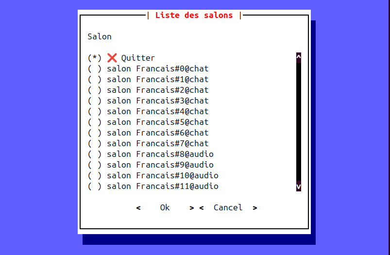
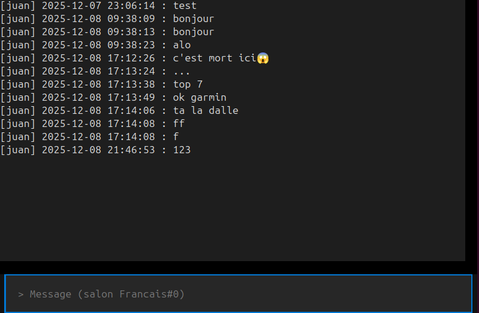

# ⚠️ Avertissement : version non-stable
Korixa n’est pas encore prêt pour un déploiement en production.
Cette version est fournie à des fins de tests, d’expérimentation et de retour utilisateur.
La compatibilité, la sécurité et les performances peuvent encore évoluer.


# 📑 Table des matières

-  [💻 - Installation](#-Installation)
-  [🔒 - Sécurité](#-sécurité)
-  [🚀 - Lancer un serveur Korixa](#-lancer-un-serveur-korixa)
-  [🔌 - Connexion au serveur Korixa](#-Se-connecter-à-un-serveur-Korixa)
-  [ℹ️ - À propos de Korixa](#ℹ%EF%B8%8F-à-propos-de-korixa)
-  [📷 - Assets](#-Assets)
-  [❓ - FAQ](#-FAQ)

# 💻 Installation
```bash
VERSION="0.0.2-alpha"
```
```bash
git clone --branch "$VERSION" --depth 1 https://github.com/JuanForge/Korixa.git
cd Korixa
python3 -m venv .venv
source .venv/bin/activate
```

## Client
```bash
pip install -r requirements-client.txt
```

## Serveur
```bash
pip install -r requirements-server.txt
```


# 🔧 Installation développeur
```bash
git clone https://github.com/JuanForge/Korixa.git
cd Korixa
python3 -m venv .venv
source .venv/bin/activate
pip install -r requirements-client.txt
pip install -r requirements-server.txt
```

## 📄 Préparation des certificats

Instructions détaillées : **[voir TLS.md](./TLS.md)**

## 🚀 Lancer un serveur Korixa

Une fois vos certificats prêts, lancez le serveur :

```bash
python3 server.py --host 127.0.0.1 --port 12347 --max-connections 16 --ssl --tls13
```
- Pour lancer un serveur sans chiffrement (donc sans gestion de certificats), il suffit de ne pas inclure les options --ssl et --tls13. Cette configuration est fortement déconseillée, car elle expose le flux à une lecture directe et augmente considérablement les risques d’interception.


# 🔌 Se connecter à un serveur Korixa

Le client Korixa permet de rejoindre un serveur en quelques secondes, que ce soit en local, en réseau classique ou via un service caché.

### 📜 Certificat du serveur (CA) — Important avant toute connexion TLS

Si le serveur utilise SSL/TLS et qu’il n’est pas signé par JuanForge, vous devez importer la Certificate Authority (CA) fournie par l’administrateur du serveur dans [ authority.pem](./authority.pem).

Sans cette CA, le client refusera la connexion sécurisée pour éviter tout risque de faux serveur ou d’attaque MITM.

### Connexion standard
```bash
python3 client.py --server 127.0.0.1:12347
```
---

| Type de connexion                     | Commande                                                                     |
| ------------------------------------- | ---------------------------------------------------------------------------- |
| **Connexion simple**                  | `python3 client.py --server 127.0.0.1:12347`|
| **Connexion sécurisée (TLS)**         | `python3 client.py --server 127.0.0.1:12347 --ssl`|
| **Via proxy SOCKS5**                  | `python3 client.py --server 127.0.0.1:12347 --proxy 127.0.0.1:9050`|
| **Vers un [ service onion](https://en.wikipedia.org/wiki/Tor_(network)) (anonymat maximal)** | `python3 client.py --server xxx.onion:12347 --proxy 127.0.0.1:9050 --ssl`|

# 📂 Index des serveurs Korixa

|🌐 Adresse                                                           |🖊️ Signé par|🔒 TLS|🏷️ Nom du serveur|📡 Type de connexion|📌 Version |⏱️ Temps de réponse|status|
|---------------------------------------------------------------------|------------|------|-----------------|--------------------|-----------|--------------------|-----|
| zhhfgkv4ley42fb2plut6j5raecxq2bu4lnlc4wwo3os724oea6fzjqd.onion:12347| JuanForge  |✅ Oui| Tor hidden main | tor + TLS + TCP    |0.0.2-alpha|X ms                |Up   |
| X                                                                   | X          |❌ Non| X               | X                  |0.0.1-alpha|X ms                |Down |


# ℹ️ À propos de Korixa

Korixa est un système de communication privé, rapide et entièrement auto-hébergé.
Il permet à n’importe qui de déployer un serveur de messagerie sécurisé, sans dépendre de services externes, sans cloud, sans surveillance et sans collecte de données.

Pensé pour discuter en temps réel facilement et sans contraintes, Korixa propose un chat fluide, organisé en salons, avec un historique clair et une interface simple.
Le tout avec un anonymat maximal, idéal pour échanger, collaborer et rester connecté en toute discrétion.

# 🔒 Sécurité

Korixa est conçu pour offrir une communication privée, robuste et protégée contre l’interception :

* Chiffrement de bout en bout entre client et serveur
* Communications sécurisées via TLS
* Certificats serveur personnalisés
* Protection contre l’écoute réseau et le MITM (si vous maîtrisez vos certs)
* Compatible SOCKS5 et services cachés

# 📷 Assets



# ❓ FAQ

### **1. Sur quels réseaux peut-on utiliser Korixa ?**

Korixa fonctionne sur **tous les réseaux** : IP locale, réseau domestique, Internet et même via Tor.

### **2. Faut-il une base de données externe ?**

Non. Pour le moment, Korixa utilise un **fichier JSON léger** pour stocker uniquement les salons. Il n’y a aucun risque de gros fichiers. Une migration vers MongoDB est prévue pour le futur.

### **3. Faut-il ouvrir des ports pour utiliser Korixa ?**

* Pour Tor : **non**, aucune ouverture nécessaire.
* Pour un réseau classique : il faut configurer une **redirection de port** sur votre box ou routeur.

### **4. Le chiffrement TLS est-il obligatoire ?**

TLS est optionnel.

* Si activé côté serveur, les clients non-TLS sont bloqués.
* Les serveurs non-TLS peuvent désactiver le chiffrement, mais c’est fortement déconseillé.

### **5. Korixa permet-il l’anonymat complet ?**

* Sans Tor : **l’adresse IP est exposée**.
* Avec Tor : **anonymat maximal**.

### **6. Peut-on changer de salon en cours de session ?**

Oui. Il suffit d’appuyer sur **CTRL+Q** pour revenir à la liste des salons et rejoindre un autre salon en temps réel.

### **7. L’historique des messages est-il disponible ?**

Oui. Korixa conserve l’historique des messages pour chaque salon, de manière locale sur le serveur, ce qui permet de ne rien rater même si vous vous déconnectez ou rejoignez plus tard.

### **8. Sur quelles plateformes fonctionne Korixa ?**

* **Linux** : confirmé.
* **Windows/macOS** : probablement compatible, tant qu’un terminal récent et Python sont disponibles.

### **9. Peut-on utiliser un proxy ou VPN ?**

Oui. Le client prend en charge les **proxy SOCKS5**, pratique pour l’anonymat ou contourner certaines restrictions.

### **10. Combien d’utilisateurs un serveur peut-il supporter ?**

Le serveur actuel utilise un modèle multi-threads simple : chaque client consomme environ 3 threads, ce qui limite la scalabilité (environ **20 connexions simultanées** sur une machine ancienne).

Une future mise à jour prévoit soit :

* **une architecture entièrement asynchrone**,
* **soit un moteur multi-threads intensif**, capable d’exploiter tous les cœurs CPU avec une efficacité proche de l’async.
>   Ces évolutions permettront de multiplier la capacité du serveur tout en réduisant la consommation des ressources.

### **11. Comment mettre à jour Korixa ?**

* Copier les nouveaux fichiers du projet.
* Ou utiliser la commande Git pour mettre à jour le dépôt.
* Vérifier avec `--help` que toutes les options sont correctes.

### **12. Peut-on désactiver complètement TLS côté serveur ?**

Oui. Il suffit de **ne pas ajouter `--ssl`** lors du lancement du serveur.

### **13. Korixa supporte-t-il l’audio ou la vidéo ?**

Pour le moment, uniquement le texte. Le support de l’audio est disponible mais reste instable, et les salons vidéo sont prévus pour le futur.

### **14. Faut-il des droits administrateur ?**

* Sur Linux, si le port est >1024 : aucun droit requis.
* Pour de nombreuses connexions : il faudra éventuellement **augmenter la limite de fichiers ouverts** (`file descriptor`) du système.

### **15. Korixa collecte-t-il des données utilisateurs ?**

Aucune collecte. Aucun log sensible n’est envoyé à l’extérieur.

### **16. Peut-on lancer plusieurs serveurs sur la même machine ?**

Non. Cela pourrait corrompre la base de données JSON.
Pour en lancer plusieurs, il faudrait créer **des copies du projet dans des dossiers séparés** et utiliser **des ports différents**.

### **17. Peut-on automatiser avec des scripts ou bots ?**

Pour l’instant, **seulement usage humain via le client CLI**. Une librairie pour bots est prévue ultérieurement.

### **18. Reverse proxy (Nginx, Traefik, etc.) ?**

Non. Korixa fonctionne en TCP pur et ne supporte pas les reverse proxies.
Seul **proxy SOCKS5** est compatible.

### **19. Utilisation avec Tor / services cachés**

Oui. Il suffit de lancer le client avec Tor comme proxy et que le serveur soit accessible via un service .onion.

### **20. Limite de taille des messages**

Le protocole ne limite pas la longueur des messages pour le moment.

### **21. Licence**

Korixa est **open-source** sous **CC BY-NC-ND 4.0**.

### **22. Chiffrement de bout en bout (E2E) sera-t-il disponible ?**

Oui, c’est une évolution prévue.
Le chiffrement de bout en bout pourrait être ajouté dans une version future de Korixa.
L’idée est de permettre la création de salons privés dédiés, où seuls les deux participants possèdent les clés de déchiffrement.
Dans ce mode, le serveur ne verrait jamais le contenu, seulement des messages chiffrés, garantissant une confidentialité totale entre utilisateurs.

### **23 : Es que Korixa est-il décentralisé ?**
Non. Chaque serveur est indépendant et auto-hébergé, mais il n’y a pas de réseau distribué entre serveurs. Une décentralisation complète pourrait être ajoutée dans une future version.